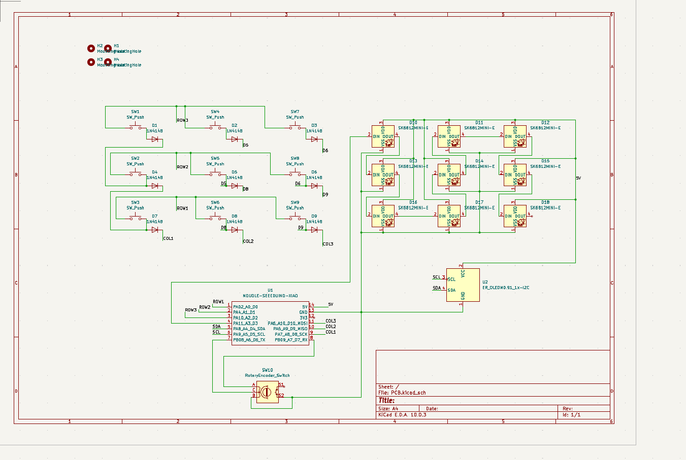
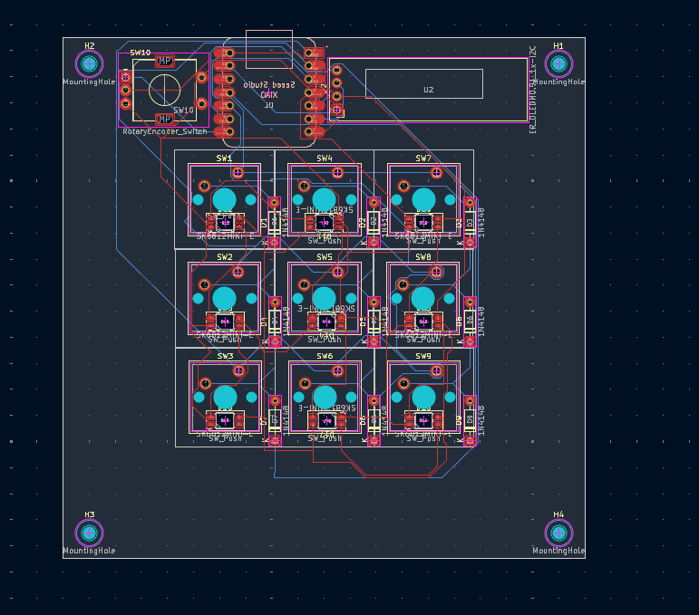
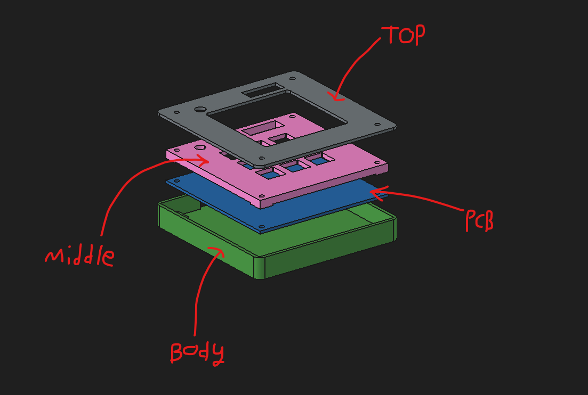

# TAR-Macropad
Quick custom Macropad

## Main Features
- 3x3 Macropad
- RGB LEDs
- Rotary Encoder
- Small OLED Screen

## Purpose
- Allow for easy, quick, programmable actions from single button presses of the macropad

## Schematic/PCB

## Casing

## Bill of Materials
- PCB (x1)
- 3D printed parts (x1)
- Cherry MX Style Switches (x9)
- 0.91" OLED Screen (x1)
- Rotary Encoder (x1)
- RGB LEDs (x9)
- Diodes (x9)
- SEED XIAO RP2040 (x1)
- Keycaps (x9)